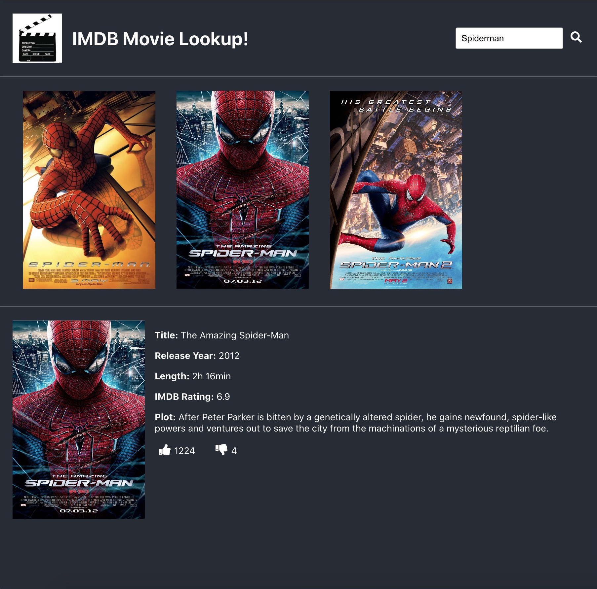

# YearOne API Assessment - IMDB Movie Lookup!

#### Backend Setup

- Clone the code from this repo to your machine: [year-one-server](https://github.com/ryanpsmith26/year-one-server)
- Make sure you have PostgreSQL installed on your machine and create a new database named year-one:

```zsh
createdb year-one
```
- next cd into the project directory from your terminal, install dependencies and run the server:

```zsh
cd year-one-server
npm install
npm run start
```

- Your terminal should indicate to you that the server is running on POR:8080

#### Frontend Setup

- Clone the code from this repo to your machine: [year-one](https://github.com/ryanpsmith26/year-one)
- next cd into the project director from another terminal window, install dependenies and run the React app:

```zsh
cd year-one
npm install
npm run start
```

- This will run a server to serve the frontend of the project
- Go to your browser and enter http://localhost:3000/ into the URL bar and you can start using the app!

#### Getting Started

- As a user, you can enter movie titles into the search bar at the top of the page.
- You will see a list of relevant matches to your search appear as movie posters.
- To learn more about a particular movie, click on the poster and you will see movie information appear.
- You may vote for that movie by clicking on the thumbs up and thumbs down buttons in the movie information section.
- Vote as many times as you want!

